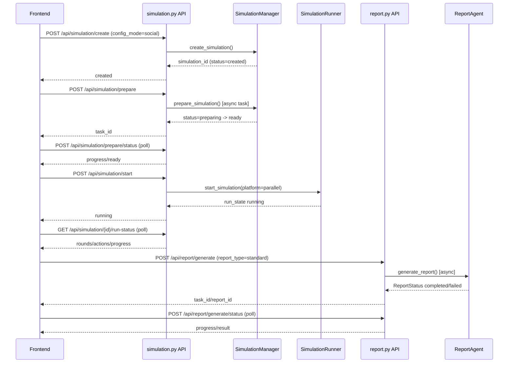
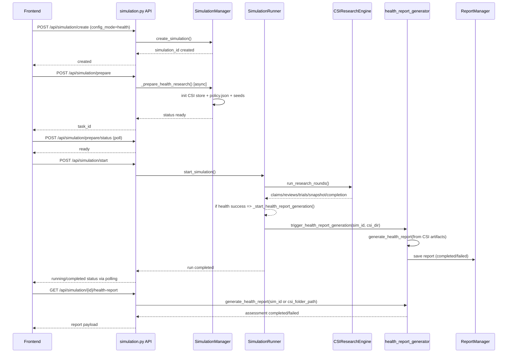
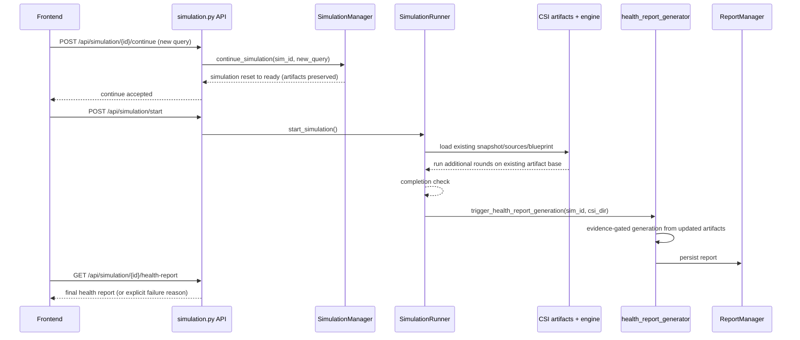

# MiroFish End-to-End Workflow Journal (Backend-first)

Last updated: 2026-04-28  
Repo root: `/Users/amar/HIVE-MIND/MiroFish`

---

## 1) System Overview

MiroFish runs two major backend pipelines:

1. **Simulation pipeline** (create → prepare → start/run → status/artifacts)
2. **Report pipeline** (generate standard report or health report from CSI artifacts)

Core architecture in current codebase:

- **State orchestration**: `SimulationManager` + `SimulationRunner`
- **CSI artifact store**: `SimulationCSILocalStore` under `uploads/simulations/<sim_id>/csi`
- **Research engine**: `CSIResearchEngine` (+ `AgentHarness`, `WebSearchClient`)
- **Report generation**:
  - Standard/agentic: `ReportAgent`
  - Health structured/offline-capable: `health_report_generator.py`

---

## 2) Backend Trigger-to-End Call Flow

## 2.1 Create Simulation

Endpoint:
- `POST /api/simulation/create`

Entrypoint:
- `backend/app/api/simulation.py::create_simulation`

Flow:
1. Accepts `config_mode` (`social`, `deepresearch`, `web_research`, `health`).
2. For `web_research`/`health`, if no project passed, creates lightweight project.
3. Calls `SimulationManager.create_simulation(...)`.
4. Persists simulation state with status `created`.

---

## 2.2 Prepare Simulation (Async Task)

Endpoints:
- `POST /api/simulation/prepare`
- `POST /api/simulation/prepare/status`

Entrypoints:
- `simulation.py::prepare_simulation`
- `simulation.py::get_prepare_status`

Flow:
1. Validates simulation + extraction quality gate (gate skipped for `web_research` and `health`).
2. Calls `SimulationManager.prepare_simulation(...)` in background thread via `TaskManager`.
3. During prepare, status moves to `preparing`.
4. Pipeline branches by mode:
   - `social`: graph-entity-based profile + config generation
   - `web_research`: query/team-based prepare via `_prepare_web_research`
   - `health`: query/team-based prepare via `_prepare_health_research`
5. CSI store initialized with:
   - `simulation_config_snapshot.json`
   - `profiles_snapshot.json`
   - `policy.json`
   - seed artifacts/sources index
6. Ends with simulation status `ready` when critical files/config are available.

Readiness check helper:
- `simulation.py::_check_simulation_prepared(...)`
- Requires core files and `config_generated=true`; also checks `csi_artifacts_ready` for CSI modes.

---

## 2.3 Start Simulation / Run

Endpoint:
- `POST /api/simulation/start`

Entrypoint:
- `simulation.py::start_simulation`
- calls `SimulationRunner.start_simulation(...)`

Important behavior:
- Supports `force=true` restart (cleans run logs, preserves config/profile).
- For CSI modes (`deepresearch`, `web_research`, `health`) runner executes CSI research phase instead of pure social loop path.

CSI runtime call chain:
1. `SimulationRunner` loads sim config + CSI snapshot sources + roster.
2. Creates policy via `build_csi_policy(config_mode)`.
3. Builds `AgentHarness` + `CSIResearchEngine`.
4. Calls `engine.run_research_rounds(...)`.
5. Persists round progress in `run_state`.
6. Refreshes blackboard snapshot + evaluates completion criteria.
7. On success:
   - runner status `completed`
   - simulation status sync to `completed`
8. On health mode success:
   - auto-triggers health report generation via `_start_health_report_generation`.

Health auto-report trigger:
- `SimulationRunner._start_health_report_generation(...)`
- calls `health_report_generator.trigger_health_report_generation(...)`

---

## 2.4 Continue Simulation (Follow-up Query)

Endpoint:
- `POST /api/simulation/<simulation_id>/continue`

Entrypoint:
- `simulation.py::continue_simulation`
- delegates to `SimulationManager.continue_simulation(...)`

Current intent:
- Continue with new query while preserving CSI artifacts/checkpoints.
- Allowed when status is `ready`, `stopped`, or `completed`.

---

## 2.5 Runtime Monitoring

Endpoints:
- `GET /api/simulation/<id>/run-status`
- `GET /api/simulation/<id>/run-status/detail`
- `POST /api/simulation/stop`

State object:
- `SimulationRunState` in `simulation_runner.py`
- tracks runner status, rounds, actions, CSI phase progress, errors.

---

## 2.6 Health Report Endpoint (Structured)

Endpoint:
- `GET /api/simulation/<simulation_id>/health-report`

Entrypoint:
- `simulation.py::get_health_report`

Modes:
1. `csi_folder_path` provided → generate from explicit existing CSI bundle path.
2. Else → generate from simulation’s CSI folder.

Implementation:
- `health_report_generator.generate_health_report(...)`
- Enforces evidence gate (requires validated claims/confidence threshold).

---

## 3) Report Generation Pipeline

## 3.1 Standard / Agentic Report

Endpoints:
- `POST /api/report/generate`
- `POST /api/report/generate/status`
- `GET /api/report/by-simulation/<simulation_id>`
- `GET /api/report/<report_id>`

Entrypoint:
- `backend/app/api/report.py::generate_report`

Flow:
1. De-duplicates existing in-progress/completed reports.
2. Creates async task + pre-allocates `report_id`.
3. Spawns `ReportAgent.generate_report(...)` in background thread.
4. Progress tracked via `ReportManager` + `TaskManager`.
5. Result status: completed/failed.

Extra report APIs:
- sections, progress, download (md/docx/pdf), chat, logs, golden-trail, delete.

---

## 3.2 Health Structured Report (Canonical CSI path)

Primary service:
- `backend/app/services/health_report_generator.py`

Canonical trigger:
- `trigger_health_report_generation(simulation_id, simulation_requirement, csi_dir_path, graph_id)`

Key behavior:
1. Resolve CSI context (`simulation_id` and/or explicit folder path).
2. Reuse existing report if already non-failed.
3. Build assessment from CSI artifacts (`generate_health_report`).
4. If insufficient evidence → fail loud with explicit reason.
5. If success → assemble markdown/sections and persist `Report`.

---

## 4) State Machines and Stage Changes

## 4.1 Simulation Status (persistent)

From `SimulationManager.SimulationStatus`:
- `created` → `preparing` → `ready` → `running` → `completed`
- Error/ops states include `failed`, `stopped`, etc.

Common transitions:
- `/create`: `created`
- `/prepare`: `preparing` then `ready` or `failed`
- `/start`: set to `running`
- runner success sync: `completed`
- runner failure sync: `failed`

## 4.2 Runner Status (runtime)

From `SimulationRunner.RunnerStatus`:
- `idle`, `starting`, `running`, `paused`, `stopping`, `stopped`, `completed`, `failed`

Used for front-end run polling and execution control.

## 4.3 Report Status

From `ReportStatus`:
- `pending`, `planning`, `generating`, `completed`, `failed`

Health and standard reports both persist through `ReportManager`.

---

## 5) CSI Artifacts, Files, and Pipeline Data

CSI directory:
- `uploads/simulations/<simulation_id>/csi`

Important files:
- `state.json`
- `policy.json`
- `simulation_config_snapshot.json`
- `profiles_snapshot.json`
- `sources_index.json`
- `blackboard_snapshot.json`
- `claims.jsonl`
- `reviews.jsonl`
- `trials.jsonl`
- `agent_actions.jsonl`
- `recalls.jsonl`
- `relations.jsonl`
- `blueprint.json`
- `entities/contradictions.jsonl`
- `entities/tasks.jsonl`

Pipeline characteristics:
- Append-only JSONL artifacts.
- Blackboards reconstructed/materialized from events + legacy files.
- Policy-driven execution for health/deepresearch (v2 style typed policy in `csi_policy.py`).

---

## 6) Scripts and Runtime Execution Units

Location:
- `backend/scripts/`

Main scripts:
- `run_parallel_simulation.py`
- `run_twitter_simulation.py`
- `run_reddit_simulation.py`
- `action_logger.py`
- `action_bundle.py`

Note:
- Prepare no longer copies scripts into every simulation folder; scripts remain centrally in `backend/scripts`.

---

## 7) Frontend Linkage (What Calls What)

Frontend API modules:
- `frontend/src/api/simulation.js`
- `frontend/src/api/report.js`
- `frontend/src/api/csi.js`

Major views/components using them:
- `Home.vue`, `SimulationView.vue`, `Step3Simulation.vue`, `SimulationRunView.vue`
- `HealthReportPanel.vue`
- `Step4Report.vue`, `ReportWorkspacePanel.vue`, `ReportView.vue`

Critical frontend↔backend mappings:
- `createSimulation` → `POST /api/simulation/create`
- `prepareSimulation` + status polling → `/api/simulation/prepare`, `/api/simulation/prepare/status`
- `startSimulation` → `/api/simulation/start`
- `getRunStatus` polling → `/api/simulation/<id>/run-status`
- `continueSimulation` → `/api/simulation/<id>/continue`
- `getHealthReport` (Health panel) → `GET /api/simulation/<id>/health-report`
- `generateReport` + status polling → `/api/report/generate`, `/api/report/generate/status`
- `getReportBySimulation` → `/api/report/by-simulation/<id>`

---

## 8) Current Health Mode Reality (Important)

What currently works:
- Health prepare/start/CSI rounds run end-to-end.
- Auto health report trigger exists after successful CSI completion.
- Health report can be generated from existing CSI bundle path.
- Evidence gating exists in health report pipeline.

Known operational pattern:
- If artifacts are already sufficient, report generation should reuse them.
- If not sufficient, CSI must be resumed/continued on same artifact base (not a brand-new high-level run) for follow-up design goals.

---

## 9) Practical Debug Checklist (Backend-first)

When a run/report fails, inspect in order:
1. `/api/simulation/<id>` state (`config_mode`, `status`, `csi_artifacts_ready`)
2. `/api/simulation/<id>/run-status` + `/run-status/detail`
3. `csi/blackboard_snapshot.json` and `completion_criteria`
4. `claims.jsonl`, `reviews.jsonl`, `trials.jsonl`, `contradictions.jsonl`
5. `/api/report/generate/status` and report progress/log endpoints
6. health endpoint response (`/api/simulation/<id>/health-report`)

---

## 10) Minimal Backend Critical Path Summary

`/api/simulation/create`  
→ `/api/simulation/prepare` (+ `/prepare/status`)  
→ `/api/simulation/start`  
→ `SimulationRunner` → `CSIResearchEngine.run_research_rounds` → CSI artifacts  
→ (health) `trigger_health_report_generation`  
→ report persisted + fetched by `/api/report/by-simulation/<id>` or `/api/simulation/<id>/health-report`.

---

## 11) Sequence Diagrams

## 11.1 Social Mode (Standard Report)

## 11.2 Health Mode (CSI + Auto Health Report)

## 11.3 Follow-up Mode (Reuse Existing CSI Artifacts First)

